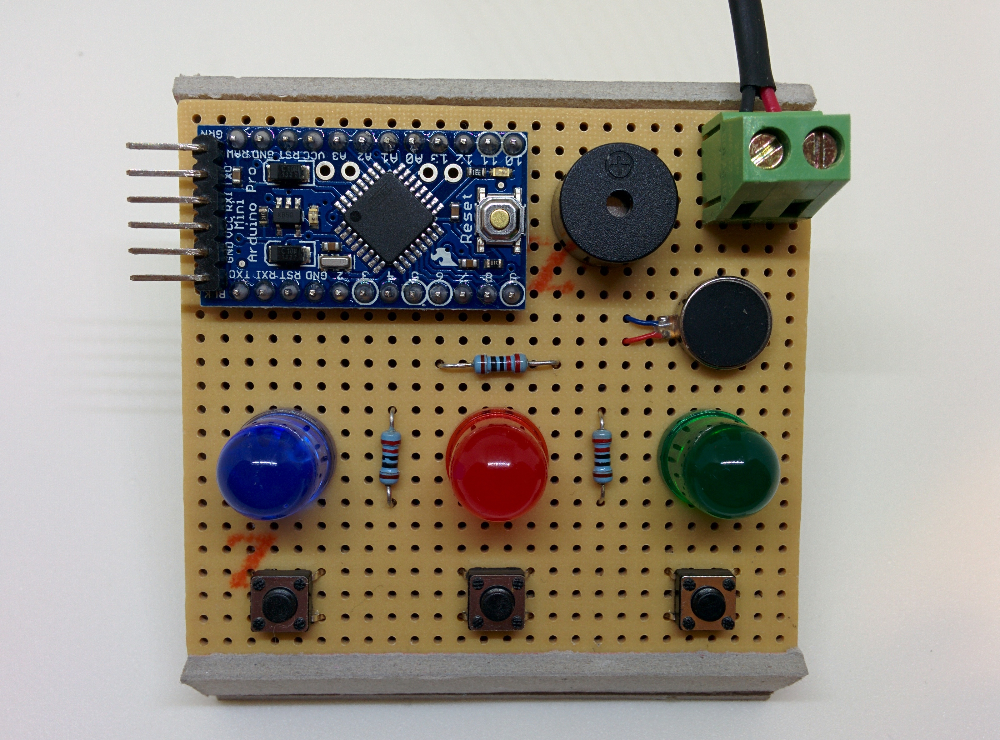

Pomodoro Arduino
================

La Técnica Pomodoro es un método para la administración del tiempo
desarrollado por Francesco Cirillo a fines de los años 1980. La técnica
usa un reloj para dividir el tiempo dedicado a un trabajo en intervalos
de 25 minutos -llamados 'pomodoros'- separados por pausas. El método
se basa en la idea de que las pausas frecuentes pueden mejorar la
agilidad mental.[1]

Este proyecto implementa un reloj pomodoro con un Arduino, un zumbador
y un motor vibrador.

[1]: http://en.wikipedia.org/wiki/Pomodoro_Technique

Características
---------------

* Vibra y suena al terminar el pomodoro
* Botón izquierda/Led azul: Reset
* Botón centro/Led rojo: Modo 25 minutos
* Botón derecha/Led verde: Modo 5 minutos

Prototipo
---------

Autor
-----

Manuel Rábade ([manuel@rabade.net](mailto:manuel@rabade.net))

Licencia
--------

Este obra está bajo una [licencia de Creative Commons
Reconocimiento-CompartirIgual 4.0
Internacional](http://creativecommons.org/licenses/by-sa/4.0/).
